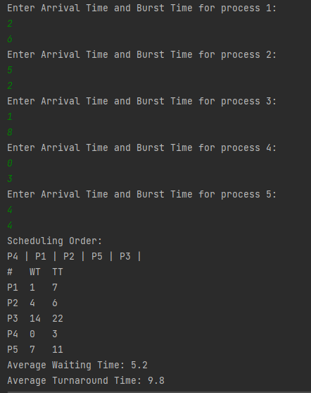
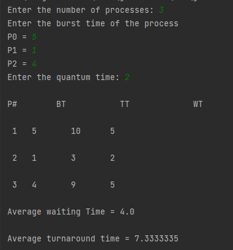

# SJF and RR
Implentation of SJF and RR in java
## Shortest Job First (SJF)
Shortest Job First (SJF) is an algorithm in which the process having the smallest execution time is chosen for the next execution. This scheduling method can be preemptive or non-preemptive. It significantly reduces the average waiting time for other processes awaiting execution.
non-preemptive SJF is implemented in <a href ="https://github.com/nouranabdlsalam/SJF-RR/blob/main/OS/src/SJF.java"> SJF.java </a>
program input: number of processes, Arrival Time and Burst Time of each process.
program output: Scheduling order, Waiting Time and Turnaround Time of each process, Average waiting time and Average Turnaround time.  
Test Case:  
number of processes = 5       
    BT    AT              
p1  6     2           
p2  2     5       
p3  8     1       
p4  3     0       
p5  4     4       

SJF Output:

## Round Robin (RR)
To schedule processes fairly, a round-robin scheduler generally employs time-sharing, giving each job a time slot or quantum[5] (its allowance of CPU time), and interrupting the job if it is not completed by then. The job is resumed next time a time slot is assigned to that process. If the process terminates or changes its state to waiting during its attributed time quantum, the scheduler selects the first process in the ready queue to execute.
RR is implemented in <a href="https://github.com/nouranabdlsalam/SJF-RR/blob/main/OS/src/RR.java">RR.java</a>
Program input: number of processes, Burst Time of each process (the program assumes that all processes have the same arrival time)
program output: Waiting Time and Turnaround Time for each process, Average waiting time and Average turnaround time.  
Test case:  
number of processes = 3   
    BT    
p1  5    
p2  1    
p3  4      

